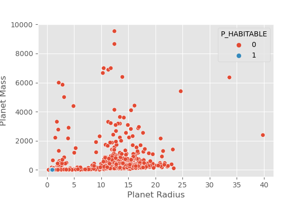
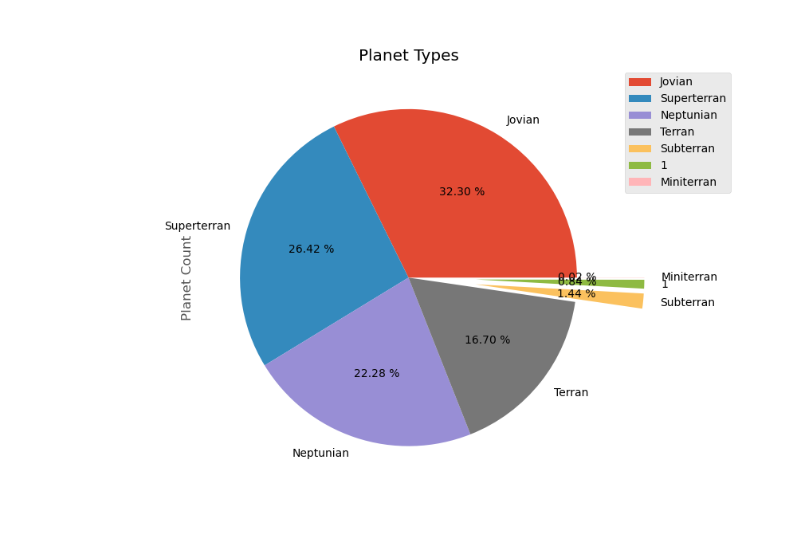


Exoplanet Classification

Shaunak Pal Abhinav Suresh Ennazhiyil Rajat Prakash

shaunak18098@iiitd.ac.in abhinav18003@iiitd.ac.in rajat18078@iiitd.ac.in

Abstract 

Existing work on characterizing exoplanets are based on assigning habitability scores to each planet which allows for a quantitative comparison with Earth. 

Over the past two decades, discoveries of exoplanets have poured in by the hundreds and the rate at which exoplan- ets are being discovered is increasing the actual number of planets exceeding the number of stars in our galaxy by or- ders of magnitude. 

The research is based on classifying exoplanets as Hab- itable and Non-Habitable. The research uses the dataset provided by NASA’s Exoplanet Archives which is from the TESS satellite. We tried various preprocessing techniques andclassifiersalongwithitsuchasKNN(K-NearestNeigh- bors), Hard-Boundary , SVM (Support Vector Machines)

and, Tree based classifiers like Random Forests and en- Figure 1: Planet Discovery(years) Vs Count semble classifiers like XGBoost to thoroughly analyze what

works best for this domain. The trained models can be re-

ferred to [\[here\].](https://github.com/blackhat-7/Exoplanet-Classification) 2.2. Features Selection

Stellar data from the Hipparcos catalog the PHL-EC dataset [\[3\].](#_page4_x308.86_y347.91) It consists of a total of 68 features (of which

1. Introduction 13 are categorical and 55 are continuous valued) and more than3800confirmedexoplanets. Thedatasetconsistsofob-

Wondering about the existence of life outside the solar served and derived attributes. Atmospheric type, mass, ra- system has led humans to unravel many secrets of the uni- dius, surface temperature, escape velocity, earth’s similarity verse. Launched in April 2018, TESS is surveying the sky index, flux,orbital velocity are the important features. fortwoyearstofindtransitingexoplanetsaroundthebright-

est stars near Earth. Exoplanets are divided into two cate- 2.3. Prediction Models

gory, Habitable and Non-Habitable. The research includes

observations and results from multiple classification tech- Gaussian Naive Bayes evaluates the classification labels niques to classify whether the planet is habitable or non- based on class-conditional probabilities with class a priori habitable. probabilities while GNB works on the assumptions that the features are independent of each other (Gaussian Distribu-

tion). The k-nearest neighbor classifier used where the dis-

2. Literature Survey : Suryoday Basak

tance between the neighbors in the input space is used as

2.1. Objective a measure for categorization . k = 3 while the weights are assigned uniform values. Creating hard-boundaries i.e. n-

Artificial Undersampling and KDE using Parzen Win- dimensional Hyper-planes. SVM without a kernel is and dow Estimation is used on (All features, Mass and Radius) with a radial basis kernel tried. The parameters setup for with different family of classifiers to classify exoplanets linear discriminant analysis classifier was implemented by intothermalhabitabilityandcharacterizethembasedonpo- the decomposition strategy similar to SVM . No shrinkage tential habitability. (PHL-EC dataset [\[3\])](#_page4_x308.86_y347.91) metric was specified and no class prior probabilities were assigned. The discrimination which leads to the best value oplanets. Various (feature,parameter) combinations with of gain is used to develop a rule; should the rule not result in SVM. A, P, R = 0.9681, 0.9309, 0.973 .

a perfect discrimination of the data , then the criterion is re- The KNN Training performance and Prediction perfor- cursively applied to the partitions in the data created by the mance are quite good. A, P, R = 0.9371, 0.854, 0.9704 previousrule. Randomforestclassifierisusedwithsplitting Random Forest Produces scaled feature importance val- criteria as Gini and elastic Gini. (augmented variable from ues which clearly show the most and least important fea- top85%featuresbasedontheirimportancedetermined) [\[2\]](#_page4_x308.86_y314.04) tures in classifying data. A, P, R = 0.9896 0.9955 0.9721.

All models performed well well, Random Forest show- 3.LiteratureSurvey: George, Brychan, Sohail ing more superior results. Following is F1 score respec-

1. Objective tively F1 (0.9515, 0.9085, 0.9837) which favours Random Forest. [\[1\]](#_page4_x308.86_y289.35)

Out of over 9500 objects discovered by Kepler Satellite

, 2000 are confirmedexoplanets. Kepler satellite can detect 4. Dataset and Preprocessing star brightness with high accuracy. It is cumbersome task

to detect whether the exoplanet is in HZ(Habitable Zone) or not. Model is trained to predict the HZ. 

2. Features Selection 

Figure 3: Planet Radius vs Planet Mass

The original dataset [\[3\]](#_page4_x308.86_y347.91) consists of 112 features. Some of the important features are planet mass, radius, surface temperature, ESI (Earth Similarity index), flux, orbital ve- locity, escape velocity, etc. The features starting with ”P ” indicates it’s about the planet while “S ” is about the star. The research will use these features to predict

Figure 2: Importance of Earth Similarity Index whether the planet is habitable (P Habitable=1,2) or not (P Habitable=0). P Habitable has values 0,1,2 where 1 and

Many features are dropped because they are ( All Ze- 2 represent optimistic and conservative habitable zones re- roes, Leakage, Free form text, Zero variance or Dupli- spectively, while 0 means the planet is non-habitable. The cate) . Koi prad (Planet Radius) , koi dicco msky (An- research will convert this into a binary variable and train gular Offset), koi fpflag nt (Transit), koi fpflag ss (Tran- our model based on this. The description and visualization sit), koi fpflag ec (Similarity to confirmed exoplanets) are of some important features are shown in the following fig- in descending order of highest importance in Random For- ures.

est classificationproviding our finalmodel. As seen in Figure 2, life favourable conditions are harder to

3. Prediction Models maintain with larger radius or mass, as it leads to very high gravity, thick atmosphere and higher atmospheric pressure.

The research paper used following Prediction models Hence planet density plays an important role. At the outset, KNN, SVM, and random forest are selected Methodologies the research removes the columns that are irrelevant for the as they are naturally robust to high dimensionality. classificationsuch as the names of the planets, the mode of (Metric - Accuracy, Precision, Recall : A, P, R) discovery, the errors in the measurements, etc. Then since SVM Did not produce expected prediction results in manycolumnshaveamajorityofmissingcolumns, wedrop terms of the proportion of observations classified as ex- them as they would provide little insight to the model. The

remaining missing values we filled using the mean (for nu- ’weights’: ’uniform’). The algorithm was chosen based merical attributes) and the mode (for categorical attributes). on the train set. ‘1’ for the value of ‘p’ indicates that the We dealt with the categorical data in 2 ways. The ordinal Minkowski distance is preferred for this problem.

features i.e, features which had some kind of order but ob- The optimal parameters for the Support Vector Machine jects where encoded using Label Encoding. Rest of the fea- were (’C’: 0.1, ’gamma’: 0.01, ’kernel’: ’linear’, ’ran- tures without any order were one hot encoded to get the best dom state’: 42). C=1.0 shows regularization is not needed out of the features. The data was then scaled to prevent the for the model and the Radial Basis Function is the most ap- features with astronomical values from overshadowing the propriate for this data-set. featureswithmicroscopicvalues. Thisisamustfordistance For random forest the optimal parameters were quite and probability based classifierslike K Nearest Neighbours complicated as follows: (’bootstrap’: True, ’crite- or Naive Bayes. The data-set is highly imbalanced as well, rion’: ’gini’, ’max depth’: 4, ’min samples leaf’: 1, and to combat that we used SMOTE for artificially over- ’min samples split’: 2, ’n estimators’: 100, ’oob score’: sampling the minority class. This will make sure the model True). using bootstrap sampling and its score improved the does not return negative for all the planets, and instead give score a bit which can help when the model is low on data a much better F1-score will results in a better model. and to reduce variance in such imbalanced class problems.

Regardless it did not perform as impressively as the other classifiers.

For the XGBoost Classifier, the optimal parameters were (’booster’: ’gbtree’, ’gamma’: 0.0001, ’learning rate’: 1, ’max depth’: 2, ’n estimators’: 100, ’subsample’: 0.85). This shows the XGBoost model is very simple as the max depth required is only 2. XGBoost and RandomFor- est, both tree based ensemble techniques did not turn out well for exoplanet classification, which could be due to the fact that it assumes that the decision boundaries are always parallel to the axes while that might not be the case actually. Logisitic regression did not perform very well when us- ing all the features available and reason is curse of dimen- sionality. When we used the top 50 most important features as given by our best model, there was a big spike in perfor- mance with an f1 score of around 0.95, which shows how curseofdimensionalitycouldeffectlogisticregression. The

Figure 4: Planet Types best parameters where (’C’: 0.001, ’class weight’: ’bal- anced’, ’dual’: False, ’max iter’: 1000, ’penalty’: ’l2’,

’solver’: ’lbfgs’). Balanced weights being the most impor-

\5. Methodology tant feature for better results.

For Gaussian Naive Bayes the following parameters Beforetrainingthemodels,astratifiedtrain-testsplitwas worked best: (’priors’: [0.1, 0.9], ’var smoothing’:

done in the ratio 15:85 for testing the models and prevents 0.000533). Thepriorwasadjustedtogivemaximumweigh- an unfortunate split, and comparing them based on met- tage to the minority class. the var smoothing parameter was rics like f1-score, precision, recall etc. Since the output adjustedusingalinearspacetoaddvariancesforcalculation is a binary label (0 is Non-Habitable and 1 is Habitable), stability

classificationalgorithms were used which include Instance- The feature importance measure for all the models show Based classifiers like KNN (K-Nearest Neighbors), Hard- that star temperature is the most contributing attribute. Boundary classifierslike SVM (Support Vector Machines), Other important factors are planet equilibrium temperature, Tree based classifiers like Random Forests and ensemble planet flux, star distance, etc. The following graph shows classifierslike XGBoost. the important features along with their scores. This will To find the optimal parameters, grid search was used with give researchers more insight on how these factors affect cross validation on 5 folds. This helps in averaging out the the habitability of a planet.

score to give a better understanding of how well the model

is performing. F1 scoring was used for evaluating models 6. Results

keeping class imbalance in mind.

For KNN the parameters were (’algorithm’: ’auto’, The missing values, imbalanced data and outliers were ’leaf size’: 2, ’n jobs’: -1, ’n neighbors’: 1, ’p’: 1, dealt with as described previously. Initially there were a

|Logistic Regression|
| - |
|Metric|Prec.|Recall|F1|Support|
|0|0.999411|0.999411|0.999411|3394.0|
|1|0.957447|0.957447|0.957447|47.0|
|Accuracy|0.998838|0.998838|0.998838|0.998838|
|Macro avg.|0.978429|0.978429|0.978429|3441.0|
|Wt. avg.|0.998838|0.998838|0.998838|3441.0|
Figure 5: Feature Importance

|Random Forest|
| - |
|Metric|Prec.|Recall|F1|Support|
|0|0.999705|0.997354|0.998529|3402.0|
|1|0.808511|0.974359|0.883721|39.0|
|Accuracy|0.997094|0.997094|0.997094|0.997094|
|Macro avg.|0.904108|0.985857|0.941125|3441.0|
|Wt. avg.|0.997538|0.997094|0.997227|3441.0|
Table 4: ClassificationReport of Logistic Regression

|XGBoost|
| - |
|Metric|Prec.|Recall|F1|Support|
|0|0.997938|0.995884|0.996909|3401.0|
|1|0.702128|0.825000|0.758621|40.0|
|Accuracy|0.993897|0.993897|0.993897|0.993897|
|Macro avg.|0.850033|0.910442|0.877765|3441.0|
|Wt. avg.|0.994499|0.993897|0.994139|3411.0|
Table 1: ClassificationReport of Random Forest

|SVM|
| - |
|Metric|Prec.|Recall|F1|Support|
|0|1.000000|0.999705|0.999853|3395.0|
|1|0.978723|1.000000|0.989247|46.0|
|Accuracy|0.999709|0.999709|0.999709|0.999709|
|Macro avg.|0.989362|0.999853|0.994550|3441.0|
|Wt. avg.|0.999716|0.999709|0.999711|3441.0|
Table 5: ClassificationReport of XGBoost

|Gaussian Naive Bayes|
| - |
|Metric|Prec.|Recall|F1|Support|
|0|1.000000|0.999117|0.999558|3397.0|
|1|0.936170|1.000000|0.967033|44.0|
|Accuracy|0.999128|0.999128|0.999128|0.999128|
|Macro avg.|0.968085|0.999558|0.983296|3441.0|
|Wt. avg.|0.999184|0.999128|0.999142|3441.0|
Table 2: ClassificationReport of SVM

|KNN|
| - |
|Metric|Prec.|Recall|F1|Support|
|0|0.999411|0.998822|0.999116|3396.0|
|1|0.914894|0.955556|0.934783|45.0|
|Accuracy|0.998256|0.998256|0.998256|0.998256|
|Macro avg.|0.957152|0.977189|0.966949|3441.0|
|Wt. avg.|0.998305|0.998256|0.998275|3441.0|
Table 6: ClassificationReport of Gaussian Naive Bayes

total of 112 features. After removing irrelevant and NaN dominant features (where more than half of the rows were NaN), finallywe have 61 features. The categorical features dealt with in 2 ways. The ordinal features were encoded using Label Encoding while features which had no specific order were then encoded to one hot encoding which proved to be better than doing just one way. We scaled the data to prevent features with huge values from overshadowing the smaller ones and thus make every feature comparable. Classifiers work best when the output classes are equally distributed, and of all balancing techniques, SMOTE Tomek worked the best.

Table 3: ClassificationReport of K Nearest Neighbors

This shows that this problem statement can easily be solved by machine learning methods and can give astronomers a huge insight into how to classify the habitable exoplanets comfortably.

\8. Contributions

- Shaunak Pal: Exploratory Data Analysis, Data Pre- processing, Data Visualisation, Training and testing models
- AbhinavS.E.: LiteratureReview, DataPreprocessing, Exploratory Data Analysis, Training and testing mod- els
- Rajat Prakash: Literature Review, Exploratory Data Analysis, Report writing

References

Figure 6: Confusion Matrix [1] S. R. George Clayton Sturrock, Brychan Manry. [Machine](https://scholar.smu.edu/cgi/viewcontent.cgi?article=1070&context=datasciencereview)

[Learning Pipeline for Exoplanet Classification,](https://scholar.smu.edu/cgi/viewcontent.cgi?article=1070&context=datasciencereview)2019.

[2] S. S. A. J. T. K. B. G. D. J. M. Suryoday Basak, Surbhi Agrawal.[ Habitability Classificationof Exoplanets: A Machine Learning Insight,](https://arxiv.org/pdf/1805.08810.pdf) 2018.

A train test split of 15:85 was made to test our model to [3] N. University Of Puerto Rico.[ PHL’s Exoplanet Catalog of the ](http://phl.upr.edu/projects/habitable-exoplanets-catalog/data/database)their limits. With such low training data and large testing [Planetary Habitability Laboratory.](http://phl.upr.edu/projects/habitable-exoplanets-catalog/data/database) 2020.

set, the SVM could achieve an f1 score of 98.9% with just

1 planet misclassified. Tree based classifiers and ensem-

ble techniques on the other hand did not perform so well.

Reasons could be such as they assume the decision bound-

aries to be parallel to the axes. This may not be the case in

real world and results could change a bit in real world but

we have tried our best to simulate real world scenario by

keeping test set size as high as possible. It does prove that

machine learning could do wonders in the fieldof exoplanet

classification.

\7. Conclusion

Exoplanet Classificationis a problem which will always remainahighlyimbalancedclassificationproblemwithma- jority of the planets being discovered being uninhabitable. Hence dealing with Imbalanced classes like using Synthetic Minority Oversampling, Stratifiedsplits etc is a must to get betterpredictions,andscalingisnecessarysincecertainfea- tures can have astronomic values while some can have mi- croscopic values.

Almost all the models which were tested have 90%+ ac- curacy with Earth Similarity Index as the most important feature. After doing Grid search over a lot of hyper param- eters for a lot of models we concluded that support vector machines perform the best with f1 scores close to 98.9%, whereas tree based algorithms did not fare that well with f1 scores just below 90% which is not that bad and we made sure that at least all habitable planets get classified rightly.
PAGE8
